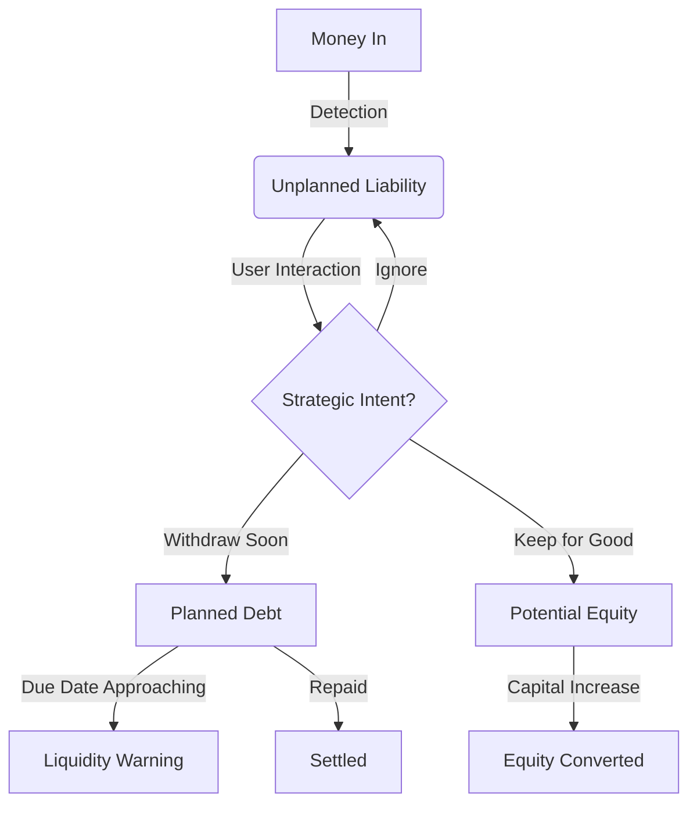

> ⚠️ **본 문서는 비공개 문서입니다. 무단 배포 및 외부 유출을 엄격히 금지합니다.**

# SYSTEM SPEC: The Liability Object (Owner's Injection)

**Phase 11-1: Responsibility Implementation**

## 1. Scenario Definition (The "Noise")
**Situation:** 
The company bank account receives **10,000,000 KRW** from **"홍길동(CEO)"**.
- **Conventional Accounting:** Records `Dr Cash / Cr Short-term Borrowing`. Done.
- **AccountingFlow (Phase 11):** This is not just a transaction. It is a **"Risk Event"**. The system creates a `LiabilityObject`.

## 2. Detection Logic (The "Sensor")
The system monitors `JournalEntry` creation.
**Trigger Conditions:**
1. Credit Account is one of: `가수금`, `단기차입금`, `임원차입금`.
2. Vendor matches `Partners[type='Executive']` OR Description contains keywords (`대표`, `가수`, `입금`).
3. Amount > 0.

**System Reaction:**
- **Status:** Marks the entry as `Accounting: Valid` / `Responsibility: Pending`.
- **UI:** Adds a **Grey Badge (⚖️)** next to the account name in the Journal/Ledger view.
- **Alert:** None. (Silence is golden). The badge sits there, waiting.

## 3. The Responsibility Interface (The "Decision")
When the user clicks the **Grey Badge (⚖️)**, the "Liability Definition Modal" opens.
It does NOT ask for accounting codes. It asks for **Strategic Intent**.

### The Core Question: "What is the destiny of this money?"

#### Option A: "It's a Loan (Debt)" (부채)
> "I intend to withdraw this money back to my personal account."
- **Required Field:** `Expected Repayment Date` (상환 예정일)
- **Optional:** `Interest Rate` (If 0%, show tax warning tooltip)
- **Result:**
    - State becomes **[PLANNED LIABILITY]**.
    - Cash Flow Engine updates: Adds a projected OUTFLOW on the due date.

#### Option B: "It's Capital (Equity)" (자본)
> "I intend to convert this to paid-in capital later."
- **Required Check:** "This is not legally Equity yet, but will be treated as 'Pre-Equity' internally."
- **Result:**
    - State becomes **[POTENTIAL EQUITY]**.
    - Excluded from "Debt Ratio" calculations in managerial dashboard.

#### Option C: "Just holding" (Grey Zone)
> "I don't know yet. Just put it in."
- **Result:**
    - State remains **[UNPLANNED]**.
    - **Risk Signal:** If `Unplanned Liabilities` > `Cash Balance`, the "Runway" widget turns **Yellow**.

## 4. State Transitions (The "Lifecycle")



## 5. Data Schema Expansion
We do not modify `JournalEntry`. We attach a `LiabilityRecord`.

```typescript
type LiabilityState = 'UNPLANNED' | 'PLANNED' | 'POTENTIAL_EQUITY' | 'SETTLED';

interface LiabilityRecord {
    id: string;
    entryId: string; // Link to the original deposit
    
    state: LiabilityState;
    
    // Responsibility Data
    lender: string; // e.g. "CEO"
    dueDate?: string; // Critical for Cash Flow
    interestRate?: number;
    
    // Audit Trail
    decisionLog: {
        decidedAt: string;
        intent: string; // "Just bridging payroll gap"
    }[];
}
```

## 6. UX Philosophy: "No Automation without Responsibility"
- The system **NEVER** auto-assigns a due date (e.g., "Default 1 year").
- If the user provides no date, the system assumes **"Callable Immediately"** (Worst Case).
- This pessimistic assumption forces the User to engage with the interface to fix their Runway projection.

## 7. Next Step
Implement `LiabilityRecord` logic in `AccountingContext` and build the `LiabilityBadge` UI.
